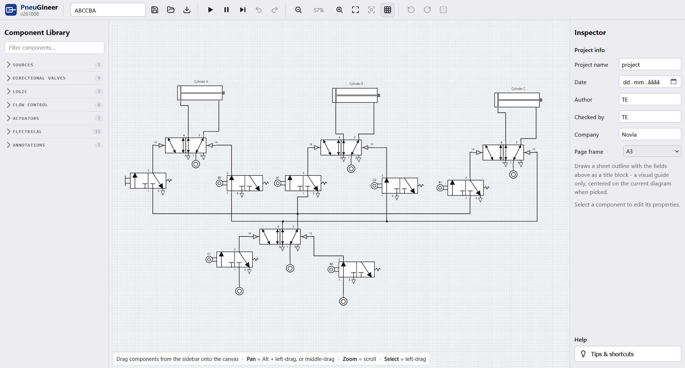

# PneuGineer

A browser-based pneumatic circuit editor and simulator. Drag components — valves, cylinders,
pressure sources, sensors — onto a canvas, wire their ports together, and run a play/pause/step
simulation with a live pressure overlay.

**▶ Try it in your browser: [bibbi88.github.io/PneuGineer](https://bibbi88.github.io/PneuGineer/)**



This is an educational project focused on flow _logic_, not flow _calculations_ — pressure is
modeled as a simple pressurized/not-pressurized graph, not real fluid dynamics.

## Components

- Pressure source, 5/2 valve, AND / OR valve, check valve, throttle valve
- 3/2 limit valve, 3/2 push button, 3/2 air-piloted valve
- Double-acting and single-acting (push/pull) cylinders
- Time delay valve, quick-exhaust valve, one-way flow control valve

## Usage

- Drag a component from the sidebar onto the canvas.
- Click a port, then click another port to wire them together. Click a wire while linking to
  split it into a junction. Double-click a wire to drag its bend.
- Use Play / Pause / Step / Stop to run the simulation, and Undo / Redo to step through edits.
- Save / Load a project as JSON, or export the circuit as an SVG or PNG. Work is autosaved
  locally and offered back if you return to an unsaved session.

## Running PneuGineer

There are three ways to run the app, from simplest to most involved.

### 1. In the browser

Open [bibbi88.github.io/PneuGineer](https://bibbi88.github.io/PneuGineer/). Nothing to install.
The site is rebuilt and redeployed automatically on every push to `main`.

### 2. Offline, from a single file

The production build is one self-contained HTML file, [`dist/index.html`](dist/index.html), with
all scripts and styles inlined. Download it (on GitHub: open the file, then **Download raw file**)
and double-click it to open it in your browser. It needs no server and no internet connection,
so it can be copied to a USB stick or shared by email.

### 3. From source

Requires [Node.js](https://nodejs.org/) 22 or newer.

```bash
npm install
npm run dev      # start the dev server, then open the URL it prints (http://localhost:5173)
npm run test     # run the unit test suite
npm run build    # type-check and write the single-file build to dist/index.html
npm run preview  # serve the built dist/index.html locally
npm run lint     # eslint + prettier check
```

## About the HTML files

- **`index.html`** (repo root) — the app's page skeleton and Vite's entry point: the toolbar,
  component sidebar, canvas layers and inspector panel, plus a `<script>` tag that loads
  `src/main.ts`. All behavior lives in the TypeScript under `src/`. This file can't be opened
  directly from disk, since browsers can't run the TypeScript it references — use
  `npm run dev`, or open the built `dist/index.html` instead.
- **`dist/index.html`** — the output of `npm run build`: `index.html` with the compiled
  JavaScript and CSS inlined into it (via `vite-plugin-singlefile`). This is the file that is
  deployed to GitHub Pages and that can be run offline.
